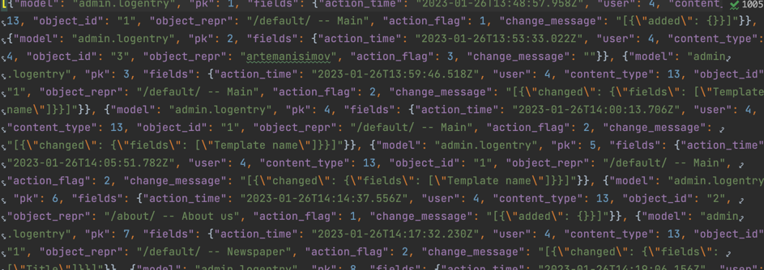

# D10-Django-ORM Управляющие команды
# Перед запуском проекта запустить виртуальное окружение через консоль:
```
    source venv/bin/activate
```

1. python manage.py makemigrations [<имя приложения>] — создание миграций (обратите внимание, что имя приложения — параметр необязательный, если его указать, то создаются только миграции для конкретного приложения)
2. python manage.py migrate — применить созданные миграции, т.е. внести изменения уже именно в саму базу данных (создать новые или редактировать старые модели).
3. python manage.py showmigrations — показать все изменения вносимые в базу данных.

### Можно выгрузить данные из вашей базы данных в каком-либо формате.

#### Для JSON:
```
    python3 manage.py dumpdata --format=json > mydata.json
```
В нём обычному человеку мало что удастся понять, т. к. он структурирован специально под задачи Django, чтобы эти данные можно было в любой момент загрузить обратно в базу. И перед тем, как мы этим займёмся, давайте попробуем выгрузить наши данные, но уже в другом формате:
#### Для XML:
```
    python3 manage.py dumpdata --format=xml > mydata.xml
```

Так, ну и теперь попробуем удалить данные через админ-панель и снова загрузить их, но уже через команду <b>loaddata</b>:
```
    python3 manage.py loaddata mydata.json
```