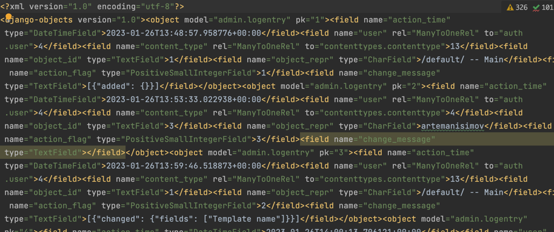

# D10-Django-ORM Управляющие команды
# Перед запуском проекта запустить виртуальное окружение через консоль:
```
    source venv/bin/activate
```

1. python manage.py makemigrations [<имя приложения>] — создание миграций (обратите внимание, что имя приложения — параметр необязательный, если его указать, то создаются только миграции для конкретного приложения)
2. python manage.py migrate — применить созданные миграции, т.е. внести изменения уже именно в саму базу данных (создать новые или редактировать старые модели).
3. python manage.py showmigrations — показать все изменения вносимые в базу данных.

### Можно выгрузить данные из вашей базы данных в каком-либо формате.

#### Для JSON:
```
    python3 manage.py dumpdata --format=json > mydata.json
```
В результате у нас в каталоге должен появится файл примерно следующего содержания:

В нём обычному человеку мало что удастся понять, т. к. он структурирован специально под задачи Django, чтобы эти данные можно было в любой момент загрузить обратно в базу. И перед тем, как мы этим займёмся, давайте попробуем выгрузить наши данные, но уже в другом формате:
#### Для XML:
```
    python3 manage.py dumpdata --format=xml > mydata.xml
```

В итоге получится похожий файл, но уже в XML-формате:


Так, ну и теперь попробуем удалить данные через админ-панель и снова загрузить их, но уже через команду <b>loaddata</b>:
```
    python3 manage.py loaddata mydata.json
```

В итоге у нас должно появится следующее сообщение в консоли:

```
    Installed 3 object(s) from 1 fixture(s)
```

Это говорит о том, что данные снова загрузились успешно! (Постарайтесь, чтобы в ваших объектах не было полей с русскими буквами, иначе можно жёстко застрять с кодировкой).

Последние две команды могут служить для самых разных целей, но как правило в большинстве случаев, они используются для создание тестовых данных. Например, данных для базы данных тестового сервера или же фикстур для тестов (тесты мы затронем немножко попозже, но это тоже довольно интересная вещь). Также не обязательно выгружать целиком данные из всего проекта, можно выгрузить данные из какого-то одного приложения, для этого достаточно добавить аргумент с названием приложения:


```
    python manage.py dumpdata --format=xml sample_app > sampledata.xml 
```

Параметр <b>--database</b> может указывать на базу данных (названия берутся из настроек), из которой будут выгружаться или в которую будут загружаться данные, на случай если у вас их несколько.

Ну и команда экстерминатус — полная очистка базы данных, т. е. удаление всех данных из таблиц в ней.

```
    python manage.py flush 
```

Если у вас несколько баз данных, то можно указать всё тот же параметр <b>--database</b> и очистить какую-то конкретную БД.


## Доработайте свой интернет-сервис. Напишите команду для manage.py, которая будет удалять все новости из какой-либо категории, но только при подтверждении действия в консоли при выполнении команды.

Для этого работает в папке management/commands/category_delete.py

1. В методе `add_arguments` добавьте аргумент `category`, который будет принимать название категории, из которой нужно удалить все новости.
2. В методе `handle` получите значение аргумента `category`, запросите подтверждение пользователя, а затем выполните удаление новостей из указанной категории. Если пользователь подтвердил действие, выводите сообщение об успешном удалении новостей. Если произошла ошибка, вызовите исключение `CommandError` и выведите сообщение об ошибке. Если пользователь отказался от удаления новостей, выведите сообщение о том, что действие было отменено.
3. Запустите команду `python manage.py delete_category_posts <category_name>`, где `<category_name>` - название категории, из которой нужно удалить все новости. При выполнении команды пользователю будет предложено подтвердить удаление новостей. Если пользователь подтвердит действие, новости будут удалены, в противном случае - ничего не произойдет.